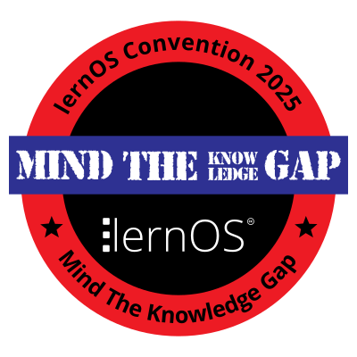

# loscon25 Un-Konferenzband

Die [lernOS Convention 2025](https://wiki.cogneon.de/loscon25) (loscon25, 1.-2. Juli 2025) hat das **Motto "Mind the Knowledge Gap"** ([Blog](https://cogneon.de/2025/03/02/mind-the-knowledge-gap-das-motto-der-lernos-convention-2025/)). Die loscon ist keine klassische Konferenz, sie kombiniert Elemente von Konferenz, Barcamp/Un-Konferenz und Community-Treffen (Convention = Zusammenkunft).

Für diese **Dokumentation** setzen wir **Künstliche Intelligenz** und die **lernOS Produktionskette** ein. Es entsteht diese **Website** und **Dokumente** in verschiedenen Formaten (z.B. PDF, E-Book), die in der Navigation unter *Download* heruntergeladen werden. Außerdem können die Inhalte der Dokumentation über einen **Chatbot** genutzt werden.

Der loscon 25 Un-Konferenzband wird unter der **Lizenz Creative Commons Namensnennung 4.0 International** ([CC BY](https://creativecommons.org/licenses/by/4.0/deed.de)) zur Verfügung gestellt. Der Inhalt kann und soll gerne weiter verwendet werden.
