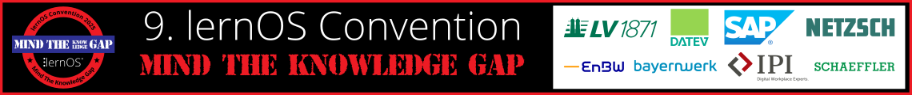

# Willkommen 



Die [lernOS Convention 2025](https://community.sap.com/t5/sap-training-and-change-management/sap-learning-and-adoption-forum-2025-save-the-date/ba-p/14048737) findet vom 1.-2. Juli 2025 in Nürnberg, an drei Satelliten Lokationen (München, Hamburg, Berlin) und Online statt. Die Inhalte dieser Dokumentation stammen aus den Aufzeichnungen der Impulsvorträge, Lightning Talks, Sessions, Workshops und Podcasts.

!!! note "Hinweis"
    Mit der Dokumentation könnt ihr sogar [mit diesem Chatbot](https://chatgpt.com/g/g-685e35df934c8191bdfbd56cd136038b-loscon25-doku-bot) (CustomGPT, Modell GPT-4o) "reden" ... das funktioniert sogar in natürlicher Sprache mit dem Voice Mode. Die KI-generierten Zusammenfassungen wurden **NICHT** nachberarbeitet. Die KI kann Fehler machen 😉

## Workflow der KI-generierten Zusammenfassung
Um die KI-basierte Dokumentation den Teilnehmenden schon während der Veranstaltung bereitstellen zu können, wurde die Auswertung und Bereitstellnug der Inhalte weitgehend automatisiert:


1. Die **Aufzeichnungen** (*Format: mp4*) der Beiträge werden von den Room Buddies in einen zentralen Onedrive-Ordner hochgeladen.
1. Die Aufzeichnungen werden aus einem von [MacWhisper](https://goodsnooze.gumroad.com/l/macwhisper) (Modell: whister-large-v3-turbo) beobachteten Ordner automatisch **transkribiert** (*Format: txt*).
1. Die Transkripte werden mit der App [Chatbox](https://chatboxai.app/) mit einem dort angelegten Copilot (nicht Microsoft Copilot) nach einheitlichem Schema **zusammengefasst** (Format: md). *(noch festzulegen, aktuell: Zusammenfassung, Gliederung, Kernaussagen, Offene Fragestellungen, Handlungsempfehlungen, Thesen, Abschluss)*.
1. Die Zusammenfassungen werden in der **Repo-Struktur** von [lernOS](https://lernos.org) in einem Github-Repository abgelegt.
1. Mit der **lernOS Produktionskette** wird aus den Markdown-Dateien automatisch diese Web-Version sowie weitere Formate zum Download (pdf, html, docx, md) erzeugt.
1. Die Markdown-Version (mit allen Zusammenfassungen) wird als **"Wissensbasis" für einen Chatbot** auf Basis eines [CustomGPT](https://help.openai.com/en/articles/8554397-creating-a-gpt) verwendet. Nutzende können so mit der Zusammenfassung der Veranstaltung "sprechen".
1. Interessenten können sich eine **Markdown-Version der Dokumentation** unter *Download* zusätzlich herunterladen, um sie in eigenen KI-Tools wie z.B. [Microsoft Copilot](https://www.microsoft.com/de-de/microsoft-copilot/organizations), [SAP Joule](https://www.sap.com/germany/products/artificial-intelligence/ai-assistant.html), [Gemini](https://gemini.google.com/), [NotebookLM](https://notebooklm.google/), [Le Chat](https://chat.mistral.ai/) (europäisch) oder lokalen KI-Tools ([LM Studio](https://lmstudio.ai/), [Chatbox](https://chatboxai.app/), [GPT4All](https://www.nomic.ai/gpt4all), [Open WebUI](https://openwebui.com/)) zu verwenden.

## loscon25 Summarizer Prompt

```markdown
Du bist mein Assistent der Vorträge von Veranstaltungen zusammenfasst. Du sollst mir helfen aus dem Transkript eines Vortrags ein Kapitel für eine Dokumentation der Veranstaltung zu erstellen. Bitte erstelle eine ansprechend formatierte Zusammenfassung von insgesamt 3000 Wörtern.  

Dabei sollten folgende Punkte berücksichtigt werden: 

- Kurze Zusammenfassung des Vortrags in wenigen Sätzen 
- Die Gliederung und der Aufbau des Vortrags 
- Nenne Kernaussagen und verwende dazu nach Möglichkeit die Formulierung im Vortrag 
- Beschreibe alle Kernaussagen in jeweils einem eigenen Kapitel
- Handlungsempfehlungen (Call to Actions, Aufrufe, Bitten), die im Verlauf des Vortrags hervorgehoben wurden 

# Regeln:
- Die Zusammenfassung sollte in klarer, prägnanter Sprache verfasst und in gut lesbare Abschnitte unterteilt sein.
- Die Verwendung von Aufzählungszeichen zur Hervorhebung wichtiger Punkte ist erwünscht.
- Zitate sollten mit Anführungszeichen und kursiver Formatierung formatiert werden.
- Aufzählungen sollen mit einem Spiegelstrich "- ..." beginnen. Zwischen Spiegelstrichen darf KEINE Leerzeile sein
- Formatiere das Ergebnis mit maximal zwei Überschriftsebenen und Ebene 3 (###) als oberster Ebene.
- Formatiere die Dokumentation im Markdown Format zum Kopieren

Frage mich zuerst nach dem Transkript und bearbeite dies dann mit diesen Anweisungen.
```